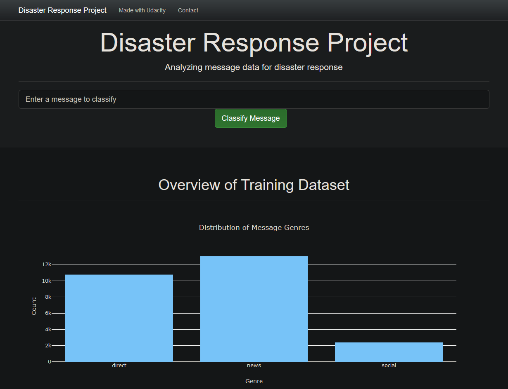
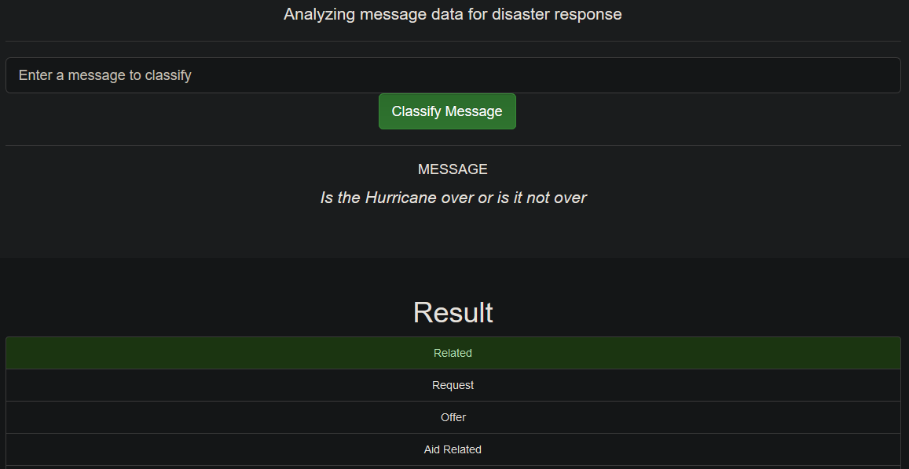
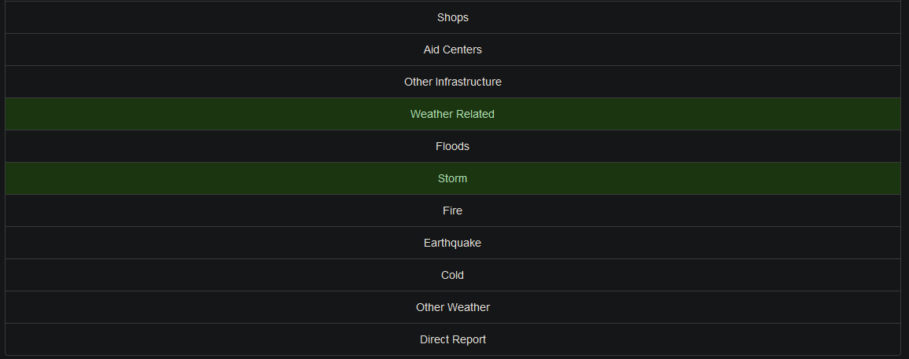

# Disaster Response Pipeline Project

# Data Scientist Nanodegree

## Data Engineering

## Project: Disaster Response Pipeline

## Table of Contents

- [Project Overview](#overview)
- [Project Components](#components)
  - [ETL Pipeline](#etl_pipeline)
  - [Machine Learning Pipeline](#ml_pipeline)
  - [Flask Web App](#flask)
- [Running](#run)
  - [Data Cleaning](#cleaning)
  - [Training Classifier](#training)
  - [Starting the Web App](#starting)
- [Screenshots](#screenshots)
- [Software Requirements](#sw)
- [File Descriptions](#files)
- [Credits and Acknowledgements](#credits)

***

## 1. Project Overview

This project is part of the Data Science Nanodegree Program by Udacity in collaboration with <a href="https://www.figure-eight.com/" target="_blank">Figure Eight</a>. The initial dataset contains pre-labeled real messages from real-life disaster events. The aim of the project is to build a Natural Language Processing tool that categorizes messages.

The project is divided into the following sections:

- Data Processing, using ETL Pipeline to extract data from the source, clean data and store it in a database
- Machine Learning Pipeline to train a model to classify messages to categories
- Web App to show model results intuitively in real-time

## 2. Project Components

There are three components of this project:

### 2.1. ETL Pipeline

File _data/process_data.py_:

- Loads the `messages` and `categories` dataset
- Merges and cleans the data
- Stores data in a SQLite database

### 2.2. Machine Learning Pipeline

File _models/train_classifier.py_:

- Loads data from SQLite database
- Creates training and test datasets
- Builds and Trains on a text processing and machine learning pipeline
- Uses GridSearchCV to optimize hyperparameters
- Score on test dataset
- Exports final model as a pickle file

### 2.3. Flask Web App

File _app/run.py_:

Run `python run.py` from app directory to start the web app where users can enter their messages, i.e., message sent during a disaster. App classifies messages into categories.

## 3. Running

There are three steps to get up and runnning with the web app if you want to start from ETL process.

### 3.1. Data Cleaning

Run the following command to execute ETL pipeline that cleans and stores data in database:

`python data/process_data.py data/disaster_messages.csv data/disaster_categories.csv data/DisasterResponse.db`

The first two arguments are input data and the third argument is the output SQLite Database name to store the cleaned data. 

### 3.2. Training Classifier

Run the following command to execute ML pipeline that trains classifier and saves:

`python models/train_classifier.py data/DisasterResponse.db models/classifier.pkl`

Loads data from SQLite database to train the model and save the model to a pickle file.

### 3.3. Starting the web app

Run the following command in the app's directory to run the web app.

`python run.py`

This will start the web app and will direct you to http://0.0.0.0:3001/ where you can enter messages and get classification results.

## 4. Screenshots

**_Information regarding training data set can be seen on main page of web app_**

**_Below is an example of a message to test ML model performance_**

**_Clicking Classify Message, will highlight the relevant text categories_**

## 5. Software Requirements

- Python 3.7
- Machine Learning Libraries: NumPy, Pandas, Sciki-Learn, pickle
- Natural Language Process Libraries: NLTK, re
- SQLlite Database Libraqries: SQLalchemy
- Web App and Data Visualization: Flask, Plotly
- python related: sys,warnings

## File Descriptions 

There are three main foleders:
1. data
- disaster_categories.csv: dataset contains categories 
- disaster_messages.csv: dataset contains messages
- process_data.py: ETL pipeline scripts to load, clean, merge and store data into a database
- DisasterResponse.db: SQLite database containing processed messages and categories data
2. models
- train_classifier.py: machine learning pipeline scripts to train, and save a model
- classifier.pkl: saved model in pkl format
3. app
- run.py: Python script to integrate all above files and to start the web application
- templates contains html file for the web applicatin
- run-windows.py: Python script to integrate all above files and to start the web application on windows machine

## 6. Credits and Acknowledgements

* [Udacity](https://www.udacity.com/) for curating a program with intensive projects.
* [Figure Eight](https://www.figure-eight.com/) for providing dataset used in the project.
